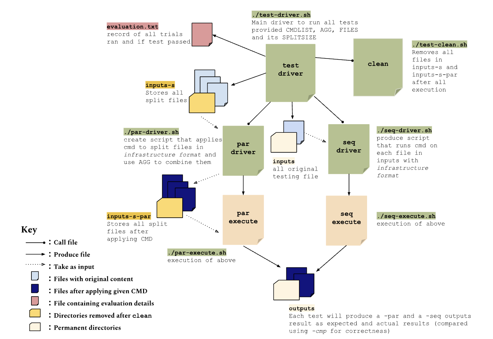

# Aggregators

Currently aggregators are WIP. The new ones are in `cpp/bin`. They are automatically built during `setup_pash.sh` and the unit tests in `cpp/tests` are run during `run_tests.sh`. The interface is like the following:

```sh
aggregator inputFile1 inputFile2 args
```

Where `args` are the arguments that were passed to the command that produced the input files. The aggregator outputs to `stdout`.

## Adding new aggregators

Let's assume that the aggregator being implemented is for a command called `cmd`.

1. Create a folder named `cmd` inside `cpp/aggregators`

2. For each `OS` supported by PaSh:

   2.1 Create a file named `OS-agg.h` inside that folder

   2.2. Implement the aggregator inside that file using the instructions provided in `cpp/common/main.h` or use a different aggregator as an example. Remember about the include guard.

   2.3 You may create additional files in the aggregator directory. This can be used to share code between aggregator implementations for different `OS`es. When `#include`ing, assume that the aggregator directory is in the include path.

3. Add unit tests for the created aggregator in `cpp/tests/test-OS.sh` for each `OS`. Consult the instructions in that file. Remember to test all options and flags of the aggregator.

Note: after completing these steps the aggregator will automatically be built by the `Makefile` with no changes to it required.

# Aggregators in ./py-2

## Overview

- After running terminal commands on file inputs using parallelization with PaSh, we must find a way to combine those parallel outputs correctly so the parallel execution of command produced matches the sequential execution
- This directory contains:
  - several aggregators in python and bash scripts that reads parallel ouput results and combines them
  - utilitie functions to assist with
    - reading + writing from/to files
    - parsing read input into string arrays for the aggregator functions
    - (for combining results of commands applied to multiple input files) matching command ran on split files in output by parsing out original full file name to ensure final combined result utilizes the original file name
  - testing scripts, highest level of execution being `./test-driver.sh` (edit here to add more tests)

## Running Aggregators

- Run the aggregator scripts, passing in parallel outputs as arguments

## Single File Argument Aggregators

### Overview

- Aggregates parallel results when commands are applied to single file input.
- Single input to a command looks like: `wc hi.txt`
- directly takes input argument from system argument; for example `./s_wc.py [parallel output file 1] [parallel output file 2]`

| Script          | Additional info. needed | Description                                                                                                                                                                   | Notes                        |
| --------------- | ----------------------- | ----------------------------------------------------------------------------------------------------------------------------------------------------------------------------- | ---------------------------- |
| `./s_wc.py`     | No                      | <li>Combines count results by adding relative values and add paddings to match result format </li><li>Supports flags `-l, -c, -w, -m`</li>                                    |                              |
| `./s_grep.sh`   | No                      | <li> Combines `grep` results (directly concat) < li><li>`.sh` for more accurate result compared to going through utilities file                                               |
| `./s_grep_c.py` | No                      | <li> Combines `grep -c` results from adding found line count</li>                                                                                                             |
| `./s_grep_n.py` | Yes                     | <li> Combines `grep -n` results by first making line corrections and then concat results</li> <li>Requires info on entire file before splitting to for line number correction | Needs to be refactored still |

### Testing

- The testing infrastructure pattern (how expected result vs. actual results are produced when applying commands and aggregators appropriately)

```
Sequential:
cat file | $CMD > file-seq.txt

Parallel:
cat file-0 | $CMD > file-0-par
cat file-1 | $CMD > file-1-par
agg file-0-par file-1-par > file-par.txt
```

- Run `./test-driver.sh` (see this script for where to edit in order to add your own test). Below shows those files and directories that are produced/interacted with after you run this script:
  

## Multiple File Argument Aggregators

- Commands when ran on single file input vs. multiple file input often produce different results as file name often gets appended to the result
- Multiple inputs to a command looks like: `wc hi.txt bye.txt` and would produce outputs that looks like

```
     559    4281   25733 inputs/hi.txt
     354    2387   14041 inputs/bye.txt
     913    6668   39774 total
```

- directly takes input argument from system argument; for example, enter in your terminal
  `python m_wc.py [parallel output file 1] [parallel output file 2]`

| File To Run   | Additional info. needed                                                                                 | Description                                                                                                                                             | Notes                                                                                                              |
| ------------- | ------------------------------------------------------------------------------------------------------- | ------------------------------------------------------------------------------------------------------------------------------------------------------- | ------------------------------------------------------------------------------------------------------------------ |
| `m_wc.py`     | N/A                                                                                                     | <li>Combines count results, appends source file name to end, includes total count</li><li>Supports flags `-l, -c, -w, -m`</li>                          | Discripancy with combining byte size (might be due to manually splitting file to create parallel input in testing) |
| `m_grep.py`   | after parallel output args: `full [path to original file 1] [path to original file 2] <more if needed>` | <li> Combines `grep` results, sort output based on source file </li>                                                                                    |
| `m_grep_c.py` | N/A                                                                                                     | <li> Combines `grep -c`, apprend prefix source file name, includes total count</li>                                                                     |
| `m_grep_n.py` | Yes                                                                                                     | <li> Combines `grep -n`, makes line correction accordingly to file</li> <li>Requires info on entire file before splitting to for line number correction | Needs to be refactored still                                                                                       |

<i>Note: all multiple argument combiners requires a [file_list] argument that is a list of all the full files utilized in the call</i>

### Testing

- testing scripts produce all relevant files directed to `/outputs` when given files in `/inputs` to produce sequential / parallel results on
- Run `./test-mult.sh` in `test-old` directory:
  1. manually split files (multiple) into 2 -- put in `/input `
  2. apply command to entire file for sequential output (expected)
  3. apply command to file-1 > output/output-1
     apply command to file-2 > output/output-2
  4. apply aggregators to combine output/output-1 output/output-2 for parallel outpus (requires path of the full files for functions such as line correction in `grep -n`)
  5. eye check that parallel outputs = sequential output
     NOTE: use `m_combine` from the [cmd].py file as aggregators
