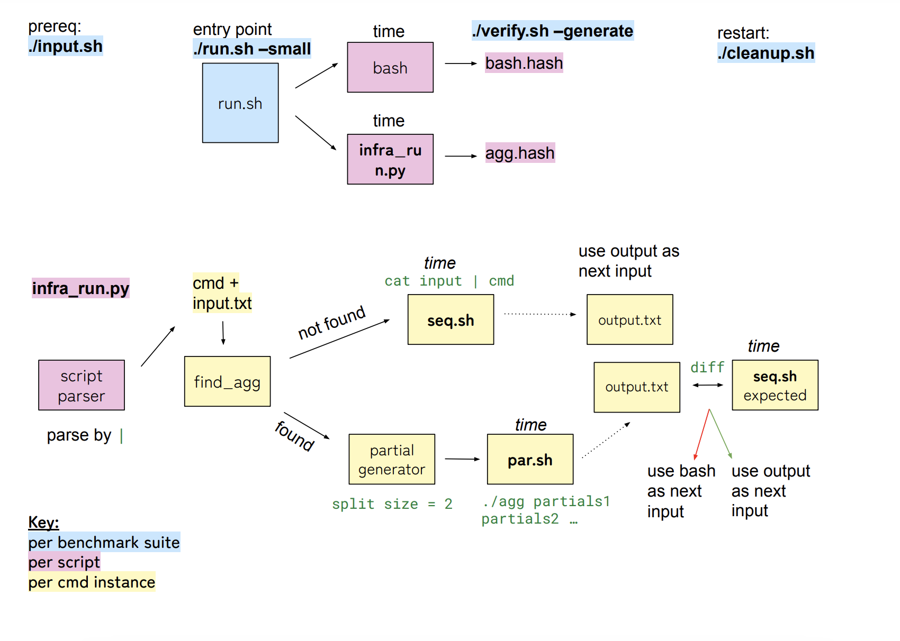

## How to Run:

- Please set the `benchmarks` directory as your root directory first (using cd `benchmarks`)
- main run script: `./simple/infra_run.py`

### Run with benchmark sets:

First `cd` into the benchmark set, and use commands such as the following:

```
cd benchmarks/oneliners
./inputs.sh # download input files
./run.sh --small # Run with default python on 1M input size
./run.sh --small -all # OR Change aggregator set; all is lean and python aggregators
./cleanup.sh # remove all intermediate files
```

### Run with custom scripts + inputs

First, make a directory in the `benchmarks` directory to organize all intermediate files (the example below uses `run`).

Below is an example,

```
# use python aggregators
mkdir run
cd run
../simple_infra/infra_run.py -n 2 -i ../oneliners/inputs/1M.txt -s ../oneliners/scripts/sort.sh -id 1 -agg python -o out.txt

# or use lean aggregators
mkdir run
cd run
../simple_infra/infra_run.py -n 2 -i ../oneliners/inputs/1M.txt -s ../oneliners/scripts/sort.sh -id 1 -agg lean -o out.txt

# or use a specified aggregator
mkdir run
cd run
../simple_infra/infra_run.py -n 2 -i ../oneliners/inputs/1M.txt -s ../oneliners/scripts/sort.sh -id 1 -agg ../../py-2/s_sort.py -o out.txt
```

Run `../simple_infra/infra_run.py -help` for argument details

### Files you'll see after running

1. infra_metrics.csv: CSV file with main metric results; Header is as follows: **script,input,input size,adj input size,cmd,agg,agg time,agg correct,cmd seq time**
2. infra_debug.log: more detailed execution log
3. inputs-s-[ID]: org: split files; cmd: files after applying current command instance (parallel partials)
4. outputs-temp: agg-[ID] parallel output files per command instance; seq-check-[ID] sequential output files per command instance (to check aggregator correctness)
5. <output.txt> : output file produced after running entire script with this infrastructure (provided as last argument to ../infra_run.py)

### Pipeline for [Running with Benchmark](#run-with-benchmark-sets)


